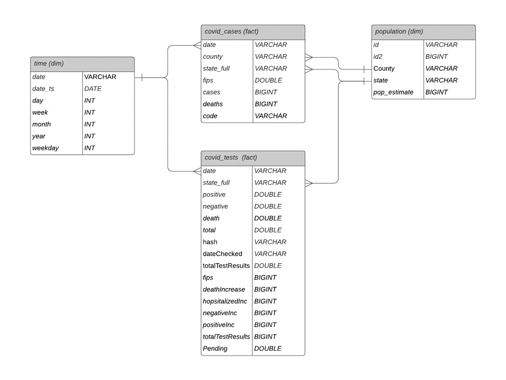

# Covid-19 Delta Lake Project

## Purpose
The purpose of this project is to prototype [Delta Lake](https://delta.io/), as a means of developing a lightweight, next-generation data lake for publically available Covid-19 data. 

As the Covid-19 situation continues to progress throughout the world, creating a centralized data repository for timely analysis can be crucial to detecting new outbreaks or at-risk areas. This projects aims to accomplish that by aggregating several datasources into a single, easily accessible, lightweight format. 

The current data sources for this data lake include:

- [Rearc Coronavirus (COVID-19) Cases by US County](https://aws.amazon.com/marketplace/pp/Coronavirus-COVID-19-Data-in-the-United-States-The/prodview-jmb464qw2yg74#overview) dataset, made available in the NIH public Covid datalake
- [Rearc Coronavirus (COVID-19) Testing by US State](https://aws.amazon.com/marketplace/pp/Coronavirus-COVID-19-Data-in-the-United-States-The/prodview-jmb464qw2yg74#overview) dataset, also made available in NIH public Covid datalake
- [NIH County Population 2018 Static Dataset](https://dj2taa9i652rf.cloudfront.net/)

These sources are current as of 9/21/2020, but will expand as time goes on.

## Method and Process
For this project, Spark and Boto3 are leveraged to extract the data from its source location, and write the data to S3 in parquet/delta format. From there, a python ETL script is also made available to load the Delta Lake data to Amazon Redshift for analysis.

The following scripts and helper scripts facilitate this process:

### Main Scripts:
- **load_delta_lake.py**: PySpark Script that reads data from the various sources and writes to a Delta Lake s3 bucket by leveraging helper functions in the <code>read_s3_boto.py</code>.
- **etl.py**: Copies data from Delta Lake s3 Bucket, by invoking helper queries in the <code>sql_queries.py</code> file, and then writes parsed data to an Amazon Redshift Data Warehouse with the following schema:

### Helper Scripts
- **sql_queries.py**: Defines drop, create, copy, and load table queries to extract data from Delta Lake s3 bucket into redshift
- **read_s3_boto**: Leverages Boto3 to interact with s3 buckets that contain source datasets from the NIH and Rearc/NYT. This tool was implemented due to iteroperability issues between the datasources and the new Spark 3.0, but may be depreciated as the bugs are resolved.
- **dwh.cfg**: Config file that contains connection parameters to the Redshift data warehouse

## Prequisites
To implement this datalake, you must have the following tools set up in your development environment:
- Spark 3.0
- Delta Lake 0.7.0
- AWS Account with Console Access
- The aws-java-sdk jar, which can be downloaded from [mvn repository](https://mvnrepository.com/artifact/com.amazonaws/aws-java-sdk). The path to this jar file must be copied to the path into the specified location in <code>load_delta_lake.py</code>
- The delta-core jar, which can be downloaded from [mvn repository](https://mvnrepository.com/artifact/io.delta/delta-core). The path to this jar file must be copied to the path into the specified location in <code>load_delta_lake.py</code>
- An S3 bucket to write the Delta files to

To create and populate the Redshift data warehouse, the following steps must completed:
1. Create AWS Redshift cluster 
2. Create IAM role with S3 read access
3. Populate the dwh.cfg file with the correct database credentials and IAM ARN

## Instructions

1. Once the environment set up, <code>spark-submit</code> the <code>load_delta_lake.py</code> file to populate the Delta Lake
2. Once the spark script is complete, run the <code>etl.py</code> file as standard python file to copy the data into Redshift  
